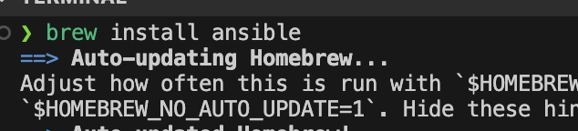
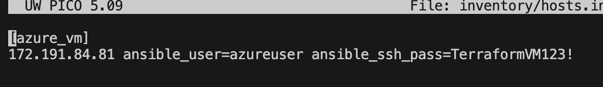
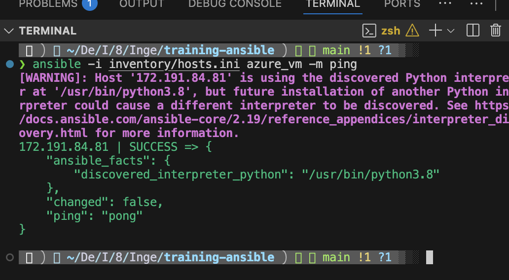
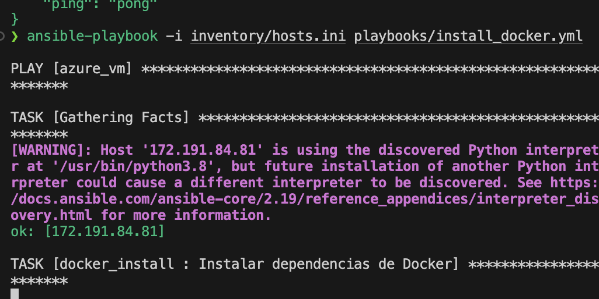
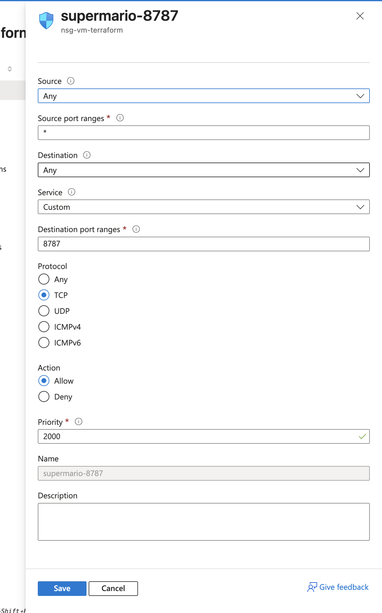
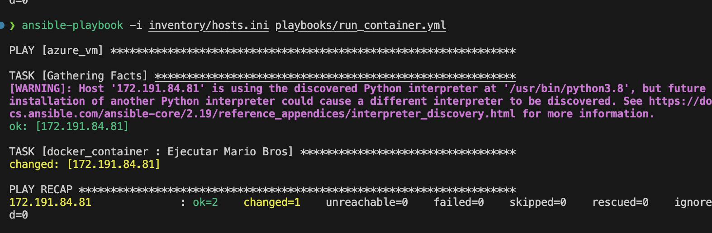
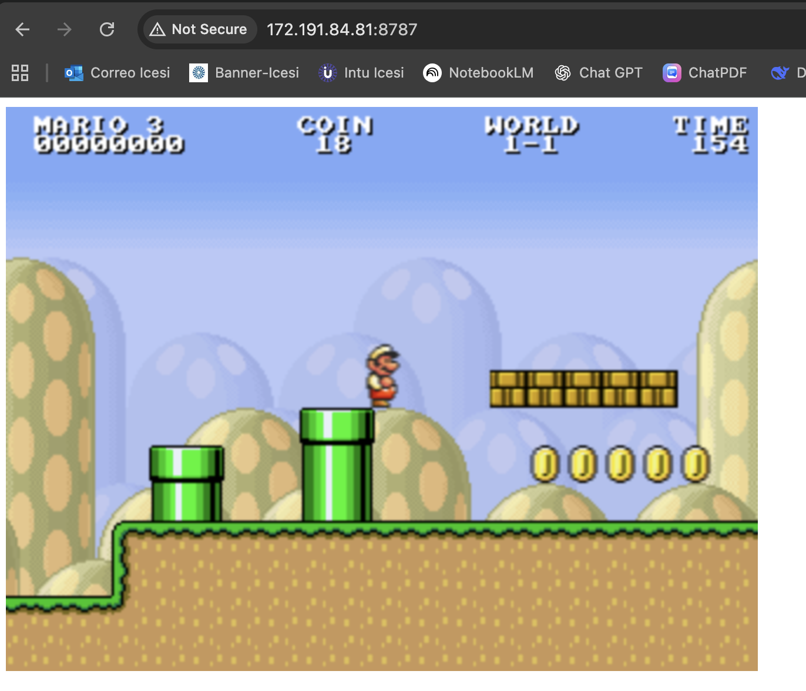

# Laboratorio de Ansible - Despliegue de Mario Bros en Azure VM

Este laboratorio muestra cómo utilizar **Ansible** para automatizar la instalación de dependencias, el despliegue de Docker y la ejecución de un contenedor con el juego clásico de **Mario Bros** en una máquina virtual en **Azure**.

---

## 1. Instalación de Ansible

El primer paso fue instalar **Ansible** en la máquina local utilizando **Homebrew**:

```bash
brew install ansible
```



---

## 2. Verificación de conexión con la VM de Azure

Se modifico el archivo de inventario `hosts.ini` con la IP de la VM, junto a su usuario y contraseña. Luego, se verificó la conectividad con el módulo `ping`:

```bash
ansible -i inventory/hosts.ini azure_vm -m ping
```

Resultado exitoso:




---

## 3. Ejecución del Playbook para instalar Docker

Se ejecutó el playbook `install_docker.yml` para instalar Docker y sus dependencias en la VM:

```bash
ansible-playbook -i inventory/hosts.ini playbooks/install_docker.yml
```



---

## 4. Configuración de reglas de red en Azure

Se creó una regla en el **Network Security Group (NSG)** para permitir tráfico en el puerto `8787` (necesario para exponer el contenedor de Mario Bros):

* **Source**: Any
* **Destination Port**: `8787`
* **Protocol**: TCP
* **Action**: Allow



---

## 5. Ejecución del contenedor con Mario Bros

Se ejecutó el playbook `run_container.yml`, el cual levanta el contenedor de Mario Bros en Docker:

```bash
ansible-playbook -i inventory/hosts.ini playbooks/run_container.yml
```

Resultado exitoso:



---

## 6. Acceso al juego desde el navegador

Finalmente, se accedió al contenedor desde el navegador usando la IP pública de la VM y el puerto `8787`:

```
http://<VM_PUBLIC_IP>:8787
```



---

## 🚀 Conclusiones

* Ansible permitió automatizar la instalación de Docker y el despliegue de un contenedor en Azure.
* El proceso se dividió en tres fases principales: instalación de dependencias, ejecución del contenedor y configuración de red.
* Se logró acceder exitosamente al juego **Mario Bros** desde un navegador.


